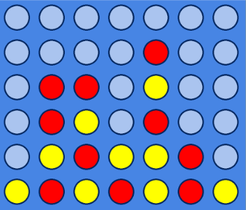

# connect4_game
**The final project on programming in C, CSED level 1 - first semester** 

    

  

Figure 1:  example on connect four of 7 x 6 board

## 1. Game Description  

- Connect 4 is a two-player game in which the players first chooses a color and then takes turns dropping their colored discs from the top into a grid.  The pieces fall straight down, occupying the next available space within the column.  The objective of the game is to connect-four of one’s own discs of the same color next to each other vertically, horizontally, or diagonally.  The two players keep playing until the board if full.  The winner is the player having greater numberof connected-fours.  You can read on [wikipedia](https://en.wikipedia.org/wiki/Connect_Four). 
---

## 2. Overview  
- The  goal  of  the  game  is  to  connect  connect-four  discs  of  the  same  color  next  to  each  othervertically, horizontally, or diagonally as you can.  The board may be of any size.  Each player is assigned a random different color.Scoreis  calculated  based  on  the  number  of  connected  fours.   The  game  ends  when  the board is full.  The winner is the player with the highest score.The map is a two dimensional grid where it has no discs at all.  Each player can select a column to drop a disc and the players should connect four discs to win.
---

## 3. In order to play the game:  
- Download the .zip file extension ("connect4.zip").
- Or use git clone.
---
## 4. Configuration file is the settings for changing the display of the game:  
- You can customize the number of rows and columns you want by changing the value between height and width tags respectively!  
- You can also customize the number of ranks that appear in top scores by changing the value between highscores tags.
